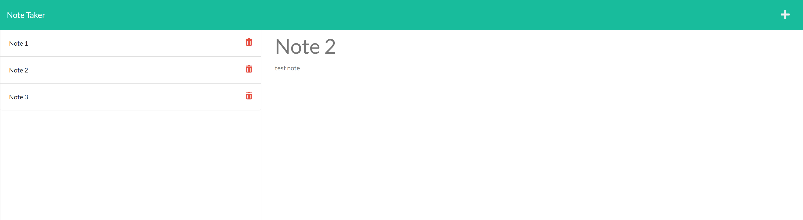

# Express.js: Note Taker

## Purpose

The purpose of this project was to create the back end for an interactive web application that allows users to create and save notes. These notes are stored in a database outside of local storage and can be accessed/modified based on user input.   

Some features of the site are:
- The user is able to enter a title and and body for each note. 
- The user is able to save the note to a list of saved notes which can be clicked on to bring back up. 
- The user is able delete the individual notes as they wish. 

The site can be found at: https://arcane-crag-29133.herokuapp.com/notes

---

## Appearance

### Here is an example of the application with some notes added and one selected form the list:  

